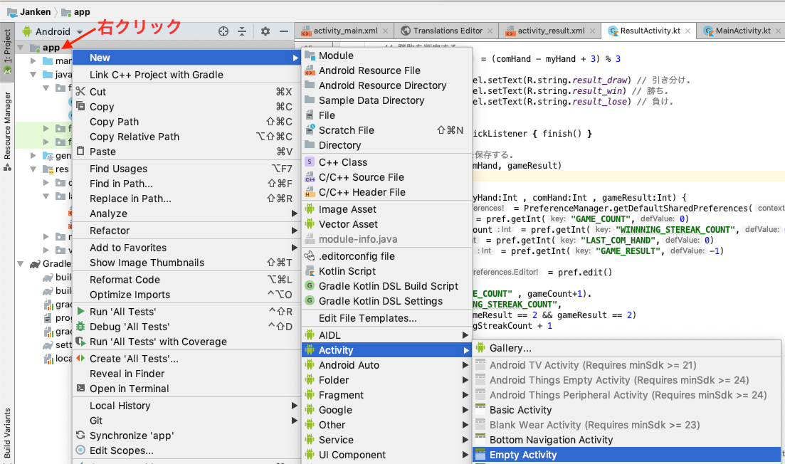
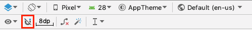
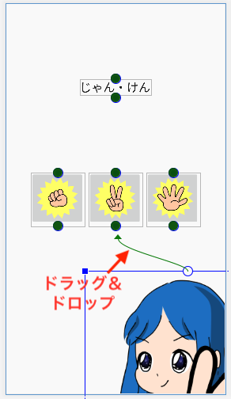
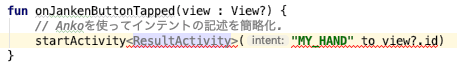
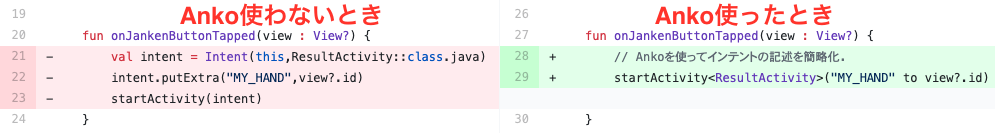

# はじめてのAndroidプログラミング 第3版
## CHAPTER05 最強！？じゃんけんアプリ

[はじめてのAndroidプログラミング 第3版](https://amzn.to/2UqaCIQ)にCHAPTER05の最強！？じゃんけんアプリで作成したプログラム

## わかったことメモ

### アクティビティの追加

プロジェクトウィンドウの **app** を右クリックして **New>Activity>Empty Activitiy** を選択する

### 制約を手動で行う

レイアウトエディターのツールバーの **U** を選択することによって自動で制約追加するかを選択できる。(図は、制約を自動で追加されない状態)

手動で制約をつけるときは、ビューを選択して○をドラッグ&ドロップして制約つけたい箇所に引く

### importが足りなくてエラーのとき

該当コードにカーソル移動して、 **Option + Enter** を押すと自動でimport文が追加される

### Ankoを使うとインテントが簡略にかける

Ankoを使うとインテントがスッキリする

